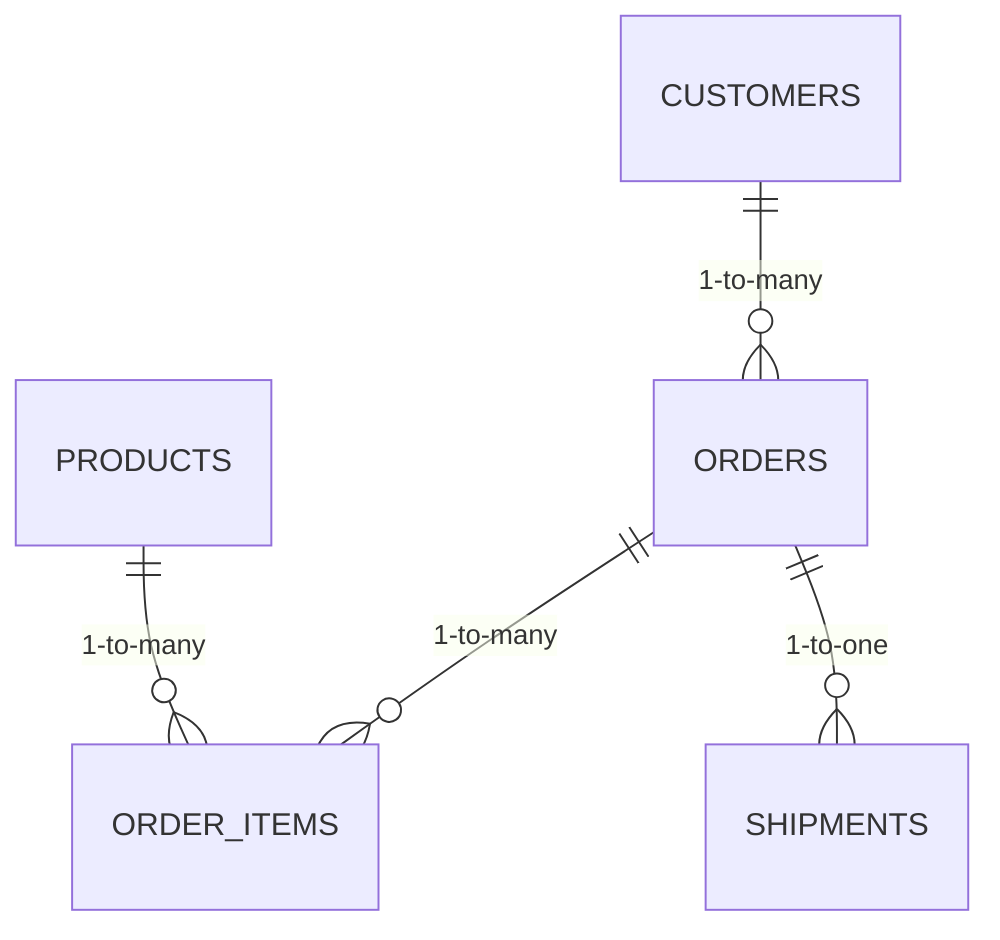

# E-commerce Data Pipeline: Synthetic Data Generation and ETL Process

A complete data pipeline solution that generates synthetic e-commerce data and implements ETL (Extract, Transform, Load) processes to PostgreSQL.

## 🔧 Tools Used
- **Python** (Pandas, Faker, SQLAlchemy)
- **PostgreSQL**
- **Jupyter Notebook**
- **Dotenv** (Environment Management)

## 🚀 Features
- Synthetic data generation for:
  - Customers (150 unique records)
  - Products (20 items across 5 categories)
  - Orders (10,000+ transactions for 2024)
  - Shipments with intelligent status logic
- Relational database modeling with:
  - Table relationships (Customers → Orders → Shipments)
  - Data integrity constraints
- Automated ETL pipeline:
  - CSV-to-Database loading
  - Data validation checks

## 📊 Data Model

